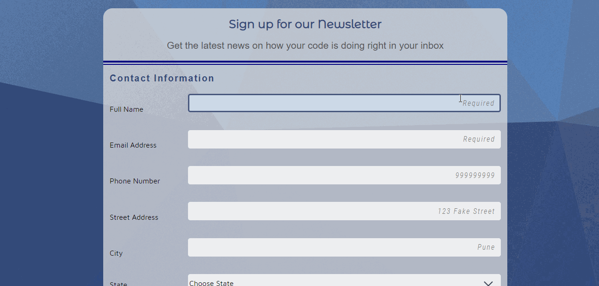
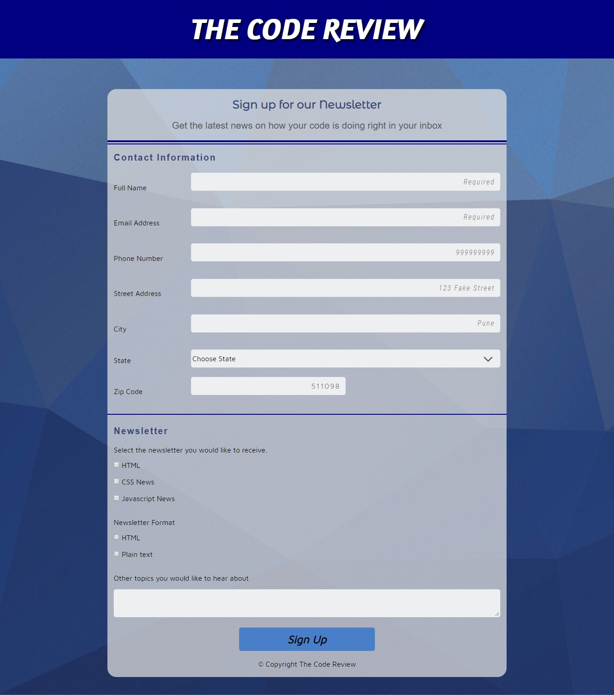
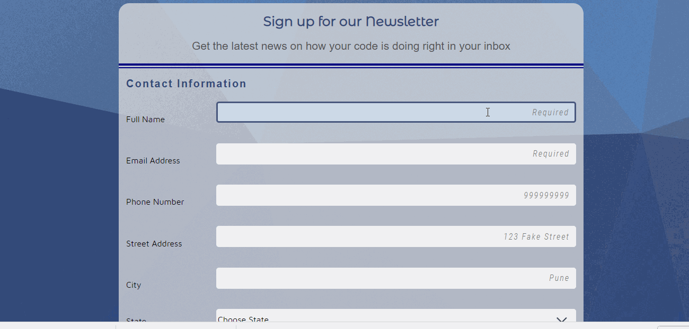

# Registration Form
[Demo Registration Form Here](https://yog9.github.io/Registration-Form/)

### Summary
 Registration form  is a responsive form made using a variety of HTML form input types and attributes. 
 
 The form was enhanced using HTML5 validation properties to make sure required fields are filled out.

### Motivation
The purpose of this project was to understand more about HTML5 form elements , responsive design along with CSS Transitions and Transforms.

### Getting Started
 Click the demo link or clone/download the repository on your local machine and open the index.html file with a browser.
 
 Fill your details in the form and click the signup button.
 
 ### Built With
* HTML5
* CSS3

### Features
**1. Responsive Design**

Mobile View                |  Desktop View
:-------------------------:|:-------------------------:
       | 

**2. HTML5 Validation**

### Coming Soon 
- [ ] Submitting the form using  a server side language to process the user's input.
- [ ] Using JavaScript to enhance and make the form more user-friendly by providing helpful error messages when the user enters 
      invalid information into the form fields.
- [ ] Providing a real-time validation error message.i.e rather than providing an error message on submitting the form ,the           form will check for errors and display messages as the user begins typing inside a text field. 

